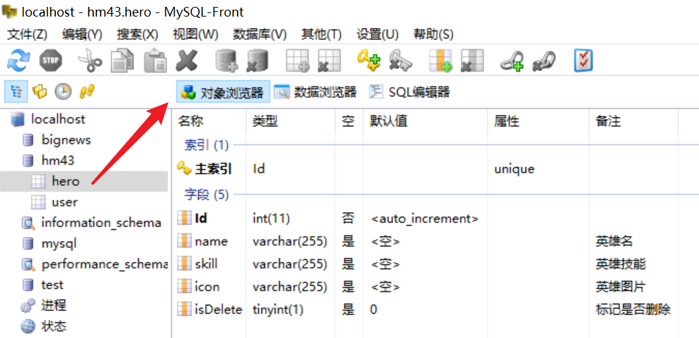
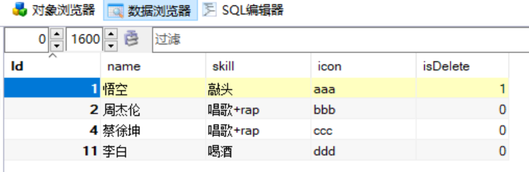
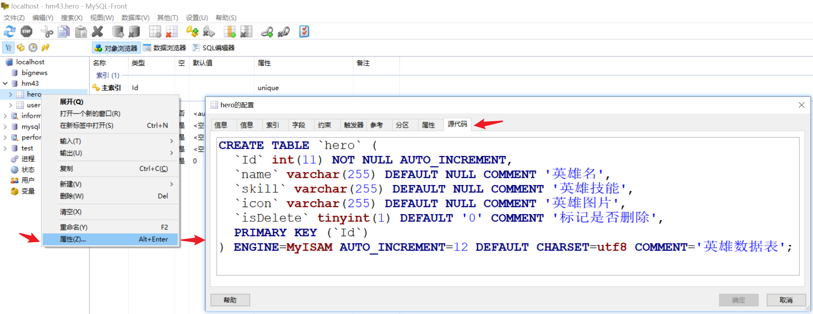

## MySQL 数据库

### 软件安装

1. 其他资料中的服务器软件
2. phpstudy解压之后，下一步即可
3. 不要用中文，建议装c盘
4. 弹出的运行框，运行
5. 打开软件之后 点击启动 变绿了 并且不会变回红色说明开启了
6. 只需要开启mysql即可

#### phpstudy 

1. 全家桶软件
2. 整合了php开发需要用到的所有资源
   1. 服务器软件: apache（不需要）
   2. 数据库软件: **mysql**（需要）
   3. php的语言环境（不需要）
3. 自己独立安装 mysql 很容易出现配置错误问题，卸载比较麻烦

## MySQL 基本使用

1. 非常流行的 数据库(数据的仓库)

   1. Oracle
   2. MSSQL
   3. SQLite

2. 免费，开源

3. 用它 保存数据更加的**安全**，提供了很多的数据保护机制，比如备份，回滚，用户设置....

4. 如果用文本保存数据

   1. 轻易删除
   2. 轻易获取
   3. 无法还原

5. 专门的职业

   1. 专业的后端
2. 数据库管理员 （DBA）


### 启动 MySQL


## MySQL 数据库可视化工具

### 查看数据


### 新建数据库


### 新建数据表


### 新建字段


## SQL语句

说在前面的话：后端比较熟练。专门的数据库维护人员很熟练，前端开发者了解即可。

### 注释

```sql
-- sql 注释，两个中杆加一个空格隔开。
-- create table yiti2 select * from yitizi group by zi order by id asc
```

### 增


```sql
-- 增加一条数据
-- 增加语法：
--     insert into 表名(字段1,字段2,字段3) values (数据1,数据2,数据3);

insert into hero(name,skill,icon) values ('李白','喝酒','xxx');
insert into hero(name,skill,icon) values ('杜甫','作诗','yyy');
```

### 删


```sql
-- 删除数据    (PS：我们前端其实没有删除数据的权限，因为数据很宝贵)
-- 删除语法：
--     delete from 表名 where 条件;

delete from hero where id=5;               -- 功能：在 hero 表中删除 id=5 的数据;
delete from hero where name='李白';
```

### 改


```sql
-- 修改数据       注意：单词是  update 是  te 结尾，不要写错成 ta
-- 修改语法：
--     update 表名 set 字段=值  where 条件

update hero set name='周杰伦' where id=2;
-- 修改多个字段用 英文逗号 隔开
update hero set name='周杰伦', skill='唱歌2', icon='yyy' where id=2;

```

### 查


```sql
-- 查询数据
-- 查询语法：
--      select 字段 from 表名  where 条件;
--      星号 * 代表所有字段，指定多个字段需用英文逗号隔开，如字段1,字段2,字段3

-- 目标1，查全部：在 hero 表中，查找所有字段数据。
select * from hero;

-- 目标2，根据id查一条：
select * from hero where id=2;

-- 目标3, 获取指定字段：id,name,skill
select id,name,skill from hero where id=2;
```


## Node第三方模块

1. mysql基本使用
   1. 增 insert
   2. 删 delete
   3. 改 update
   4. 查 select 


### 初体验

```js
// app.js 新建在项目的根目录下，和 package.json 同级
// app.js 一般称为 NodeJS 项目的入口文件。

// 1. 按需导入 mysql 包
const mysql = require('mysql');

// 2. 创建 mysql 数据库
const connection = mysql.createConnection({
    // 本地数据库地址 (本地服务器固定写法)
    host: 'localhost',
    // 数据库用户名 - 默认用户名是 root
    user: 'root',
    // 数据库密码 - 默认密码是 root
    password: 'root',
    // 数据库名称
    database: 'hm43'
});

// 3. 连接数据库
connection.connect();

// 4. 执行 mysql 语句，并在回调函数中获取结果
// 用法：
//    connection.query( mysql语句, 回调函数 );
// 建议：
//    mysql 语句的参数位置用反引号格式字符串数据
connection.query(`select * from hero`, (error, results) => {
    // error    错误对象
    // results  结果
    if (error) {
        console.log('操作出现错误');
    } else {
        console.log('results', results);
    }
});

// 5. 停止数据库连接(不需要停止)
// connection.end();
```

#### 注意事项

1. 数据库用户名，密码和数据库名称都要写对，否则无法连接到 mysql 数据库。
2. mysql 语句，推荐使用反引号字符串格式。
3. 数据库不需要停止连接。


## 数据库设计



### 软删除

设计表格的时候，数据比较宝贵，所以一般不会真的删除，涉及表的时候可额外的增加一个字段用来标记是否删除即可比如 `isDelete`，如：true 代表删除，false 代表还在。

但是 MySQL 数据库中没有布尔类型数据格式。

可使用 tinyint 数据类型，用 1 代表删除，0 代表还在。

了解即可：int 和 tinyint 都是整数，而 tinyint 占的字节数更少，储存一个 个位数 的字段，用tinyint(1) 更好。


### 英雄管理数据库设计



```sql
CREATE TABLE `hero` (
  `Id` int(11) NOT NULL AUTO_INCREMENT,
  `name` varchar(255) DEFAULT NULL COMMENT '英雄名',
  `skill` varchar(255) DEFAULT NULL COMMENT '英雄技能',
  `icon` varchar(255) DEFAULT NULL COMMENT '英雄图片',
  `isDelete` tinyint(1) DEFAULT '0' COMMENT '标记是否删除',
  PRIMARY KEY (`Id`)
) ENGINE=MyISAM AUTO_INCREMENT=12 DEFAULT CHARSET=utf8 COMMENT='英雄数据表';
```

可以直接执行上面的代码，即可新建 跟老师一样的数据表。

如果要查看源代码

​	右键表格，属性，源代码



## mysql第三方模块使用

步骤

1. npm搜索
2. 下载
3. c+v实例代码


### git 忽略文件

`.gitignore`

1. 在git托管的文件夹下面 新建一个文件 `.gitignore`
2. `#` 是注释
3. 忽略文件夹 直接写文件夹的名字即可


```
# 这是注释
node_modules/

# 单个文件
# app.js
```

