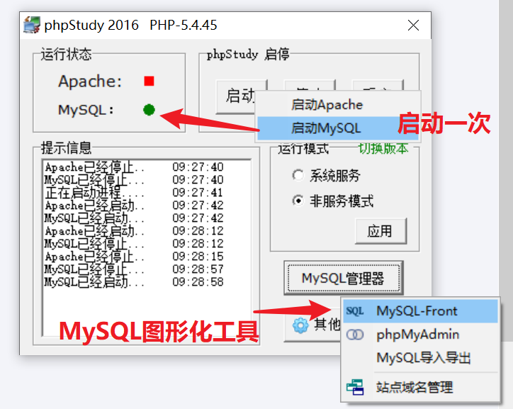
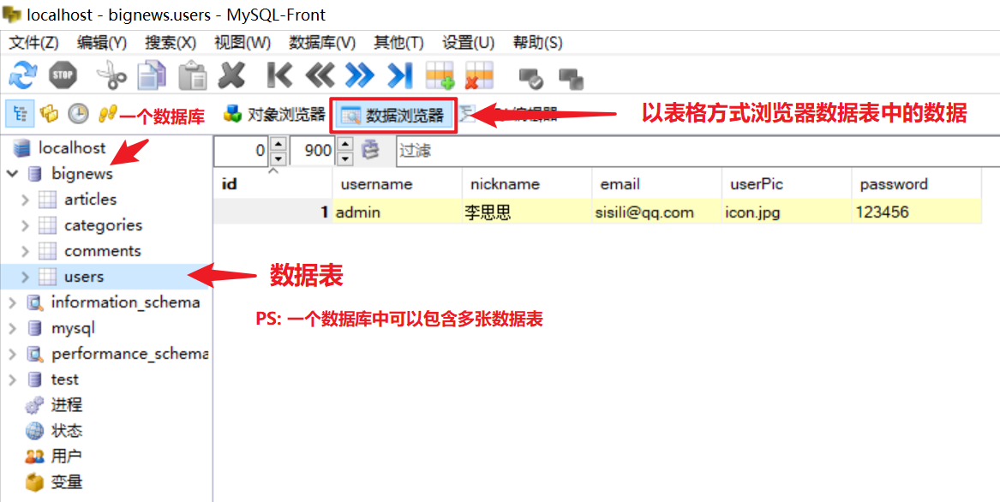
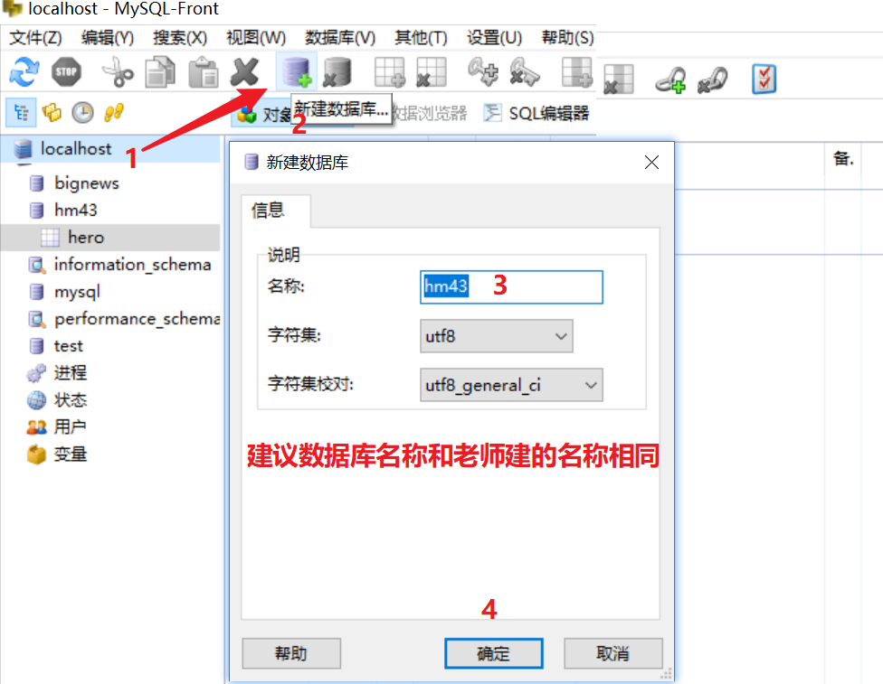
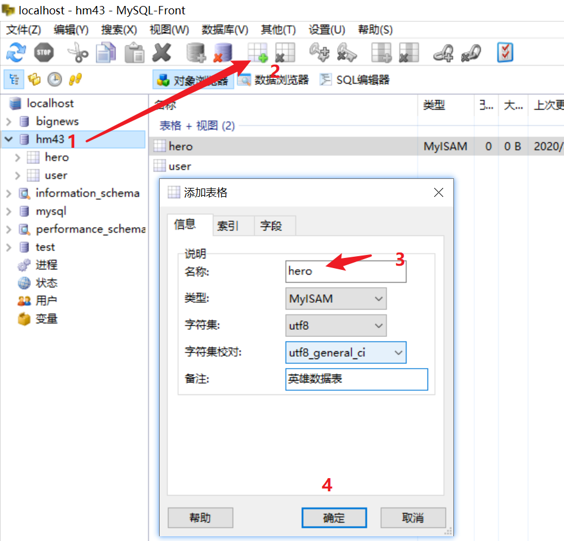
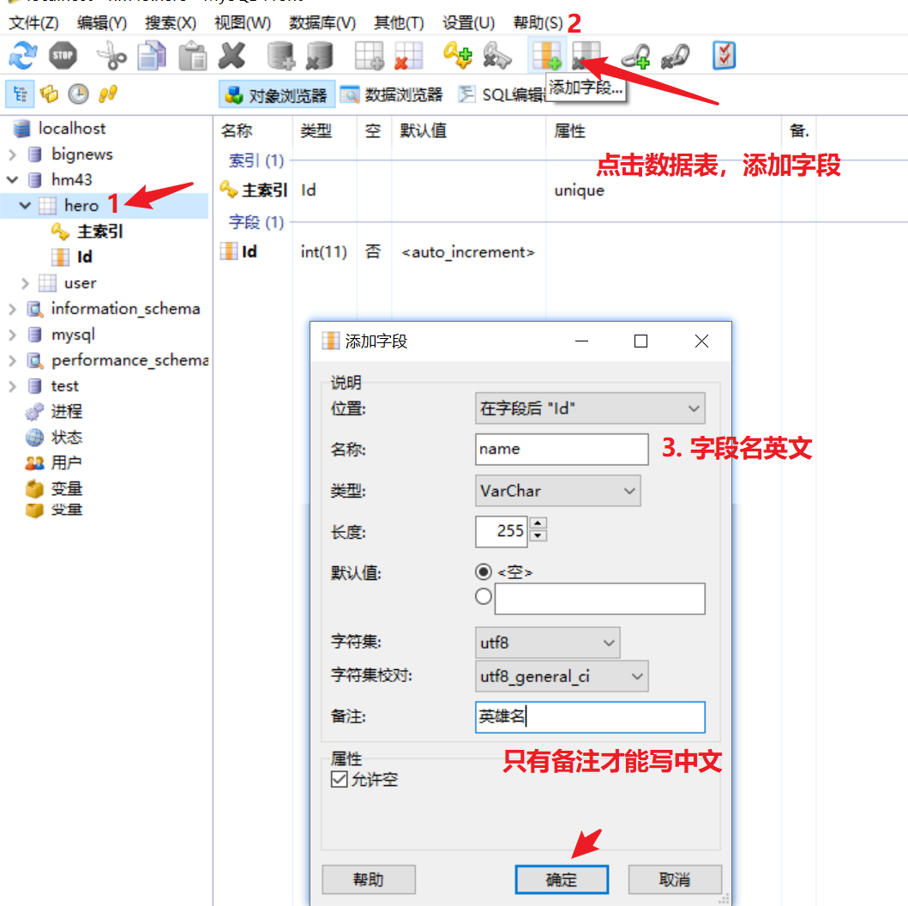
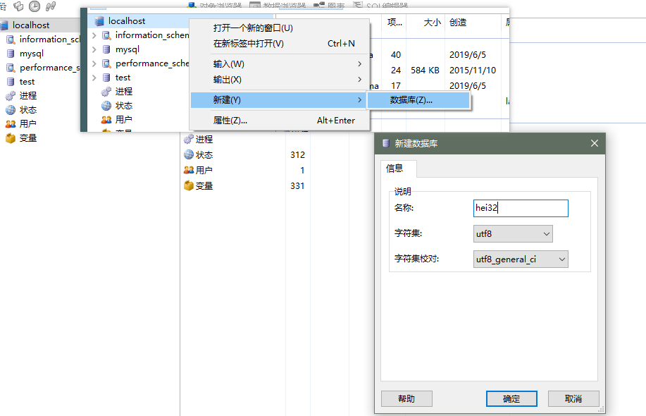
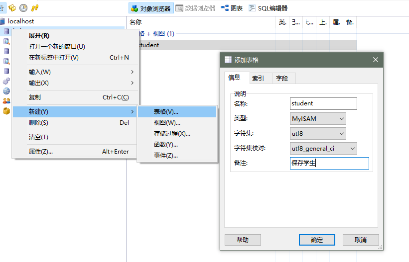
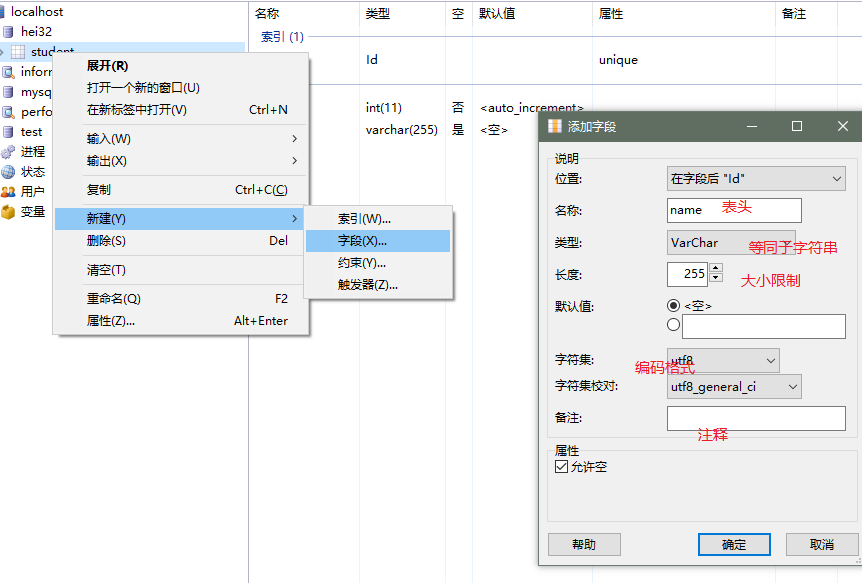
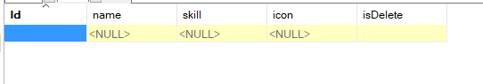
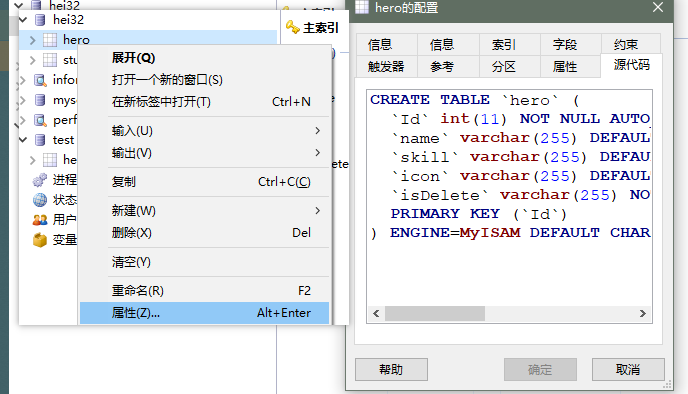

## 数据库

### 软件安装

1. 其他资料中的服务器软件
2. phpstudy解压之后，下一步即可
3. 不要用中文，建议装c盘
4. 弹出的运行框，运行
5. 打开软件之后 点击启动 变绿了 并且不会变回红色说明开启了
6. 只需要开启mysql即可

##### phpstudy 

1. 全家桶软件
2. 整合了php开发需要用到的所有资源
   1. 服务器软件: apache（不需要）
   2. 数据库软件: **mysql**（需要）
   3. php的语言环境（不需要）
3. 自己独立安装 mysql 很容易出现配置错误问题，卸载比较麻烦

### MySQL 基本使用

1. 非常流行的 数据库(数据的仓库)

   1. Oracle
   2. MSSQL
   3. SQLite

2. 免费，开源

3. 用它 保存数据更加的**安全**，提供了很多的数据保护机制，比如备份，回滚，用户设置....

4. 如果用文本保存数据

   1. 轻易删除
   2. 轻易获取
   3. 无法还原

5. 专门的职业

   1. 专业的后端
2. 数据库管理员 （DBA）


## 启动




### 查看数据




### 新建数据库




### 新建数据表




### 新建字段




#### 图形化工具

​	常规操作，入门简单。

1. 打开
2. 新建   数据库



1. 在数据库中   新建表格



1. 为表格      增加字段



1. 增删改查数据即可

#### SQL语句

​	后端比较熟练。专门的数据库维护人员很熟练。

#### Node第三方模块

1. mysql基本使用
   1. 增 insert
   2. 删 delete
   3. 改 update
   4. 查 select 

## sql语句补充

查询指定的字段

```sql
-- select 字段名，字段名2，字段名3 .. from 表名
select name,skill,id from student 
```

## 数据库设计

### 软删除

设计表格的时候，额外的增加一个字段用来标记是否删除即可比如`isDelete`

1. true 删除
2. false 还在

### 英雄管理数据库设计



```sql
CREATE TABLE `hero` (
  `Id` int(11) NOT NULL AUTO_INCREMENT,
  `name` varchar(255) DEFAULT NULL COMMENT '姓名',
  `skill` varchar(255) DEFAULT NULL COMMENT '技能',
  `icon` varchar(255) DEFAULT NULL COMMENT '头像',
  `isDelete` varchar(255) NOT NULL DEFAULT 'false' COMMENT '是否删除',
  PRIMARY KEY (`Id`)
) ENGINE=MyISAM DEFAULT CHARSET=utf8;
```

可以直接执行上面的代码，即可新建 跟老师一样的数据表

如果查看源代码

​	右键表格，属性，源代码



## mysql第三方模块使用

步骤

1. npm搜索
2. 下载
3. c+v实例代码


### git忽略文件

`.gitignore`

1. 在git托管的文件夹下面 新建一个文件``.gitignore`
2. `#` 是注释
3. 忽略文件夹 直接写文件夹的名字即可


```
# 这是注释
node_modules/

# 单个文件
# app.js
```

